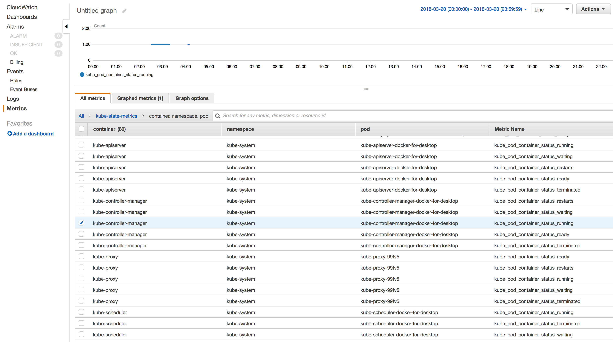
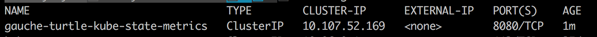

<!-- This file was automatically generated by the `build-harness`. Make all changes to `README.yaml` and run `make readme` to rebuild this file. -->

[](https://cloudposse.com)

# prometheus-to-cloudwatch [](https://travis-ci.org/cloudposse/prometheus-to-cloudwatch) [](https://github.com/cloudposse/prometheus-to-cloudwatch/releases/latest) [](https://slack.cloudposse.com)


Utility for scraping Prometheus metrics from a Prometheus client endpoint and publishing them to CloudWatch


---

This project is part of our comprehensive ["SweetOps"](https://docs.cloudposse.com) approach towards DevOps. 


It's 100% Open Source and licensed under the [APACHE2](LICENSE).


## Screenshots



*kube-state-metrics to CloudWatch*


## Usage


__NOTE__: The module accepts parameters as command-line arguments or as ENV variables (or any combination of command-line arguments and ENV vars).
Command-line arguments take precedence over ENV vars


| Command-line argument        |  ENV var                     |  Description                                                                  |
|:-----------------------------|:-----------------------------|:------------------------------------------------------------------------------|
| aws_access_key_id            | AWS_ACCESS_KEY_ID            | AWS access key Id with permissions to publish CloudWatch metrics              |
| aws_secret_access_key        | AWS_SECRET_ACCESS_KEY        | AWS secret access key with permissions to publish CloudWatch metrics          |
| cloudwatch_namespace         | CLOUDWATCH_NAMESPACE         | CloudWatch Namespace                                                          |
| cloudwatch_region            | CLOUDWATCH_REGION            | CloudWatch AWS Region                                                         |
| cloudwatch_publish_timeout   | CLOUDWATCH_PUBLISH_TIMEOUT   | CloudWatch publish timeout in seconds                                         |
| prometheus_scrape_interval   | PROMETHEUS_SCRAPE_INTERVAL   | Prometheus scrape interval in seconds                                         |
| prometheus_scrape_url        | PROMETHEUS_SCRAPE_URL        | The URL to scrape Prometheus metrics from                                     |
| cert_path                    | CERT_PATH                    | Path to SSL Certificate file (when using SSL for `prometheus_scrape_url`)     |
| keyPath                      | KEY_PATH                     | Path to Key file (when using SSL for `prometheus_scrape_url`)                 |
| accept_invalid_cert          | ACCEPT_INVALID_CERT          | Accept any certificate during TLS handshake. Insecure, use only for testing   |
| additional_dimension         | ADDITIONAL_DIMENSION         | Additional dimension specified by NAME=VALUE                                  |


__NOTE__: If AWS credentials are not provided in the command-line arguments (`aws_access_key_id` and `aws_secret_access_key`)
or ENV variables (`AWS_ACCESS_KEY_ID` and `AWS_SECRET_ACCESS_KEY`),
the chain of credential providers will search for credentials in the shared credential file and EC2 Instance Roles.
This is useful when deploying the module in AWS on Kubernetes with [`kube2iam`](https://github.com/jtblin/kube2iam),
which will provide IAM credentials to containers running inside a Kubernetes cluster, allowing the module to assume an IAM Role with permissions
to publish metrics to CloudWatch.


## Examples

### Build Go program
```sh
go get

CGO_ENABLED=0 go build -v -o "./dist/bin/prometheus-to-cloudwatch" *.go
```


### Run locally

```sh
export AWS_ACCESS_KEY_ID=XXXXXXXXXXXXXXXXXXXXXXX
export AWS_SECRET_ACCESS_KEY=XXXXXXXXXXXXXXXXXXXXXXXXXXXXXXXXXXXXXXX
export CLOUDWATCH_NAMESPACE=kube-state-metrics
export CLOUDWATCH_REGION=us-east-1
export CLOUDWATCH_PUBLISH_TIMEOUT=5
export PROMETHEUS_SCRAPE_INTERVAL=30
export PROMETHEUS_SCRAPE_URL=http://xxxxxxxxxxxx:8080/metrics
export CERT_PATH=""
export KEY_PATH=""
export ACCEPT_INVALID_CERT=true

./dist/bin/prometheus-to-cloudwatch
```


### Build Docker image
__NOTE__: it will download all `Go` dependencies and then build the program inside the container (see [`Dockerfile`](Dockerfile))


```sh
docker build --tag prometheus-to-cloudwatch  --no-cache=true .
```


### Run in a Docker container

```sh
docker run -i --rm \
        -e AWS_ACCESS_KEY_ID=XXXXXXXXXXXXXXXXXXXXXXX \
        -e AWS_SECRET_ACCESS_KEY=XXXXXXXXXXXXXXXXXXXXXXXXXXXXXXXXXXXXXXX \
        -e CLOUDWATCH_NAMESPACE=kube-state-metrics \
        -e CLOUDWATCH_REGION=us-east-1 \
        -e CLOUDWATCH_PUBLISH_TIMEOUT=5 \
        -e PROMETHEUS_SCRAPE_INTERVAL=30 \
        -e PROMETHEUS_SCRAPE_URL=http://xxxxxxxxxxxx:8080/metrics \
        -e CERT_PATH="" \
        -e KEY_PATH="" \
        -e ACCEPT_INVALID_CERT=true \
        prometheus-to-cloudwatch
```


### Run on Kubernetes

To run on `Kubernetes`, we will deploy two [`Helm`](https://helm.sh/) [charts](https://docs.helm.sh/developing_charts/)

1. [kube-state-metrics](https://github.com/kubernetes/charts/tree/master/stable/kube-state-metrics) - to generates metrics about the state of various objects inside the cluster, such as deployments, nodes and pods

2. [prometheus-to-cloudwatch](chart) - to scrape metrics from `kube-state-metrics` and publish them to CloudWatch

Install `kube-state-metrics` chart

```sh
helm install stable/kube-state-metrics
```

Find the running services

```sh
kubectl get services
```

Copy the name of the `kube-state-metrics` service (e.g. `gauche-turtle-kube-state-metrics`) into the ENV var `PROMETHEUS_SCRAPE_URL` in [values.yaml](chart/values.yaml).



It should look like this:

```sh
PROMETHEUS_SCRAPE_URL: "http://gauche-turtle-kube-state-metrics:8080/metrics"
```

Deploy `prometheus-to-cloudwatch` chart

```sh
cd chart
helm install .
```

`prometheus-to-cloudwatch` will start scraping the `/metrics` endpoint of the `kube-state-metrics` service and send the Prometheus metrics to CloudWatch


## Related Projects

Check out these related projects.

- [Prometheus Operator](https://github.com/cloudposse/prometheus-operator) - Prometheus Operator creates/configures/manages Prometheus clusters atop Kubernetes
- [terraform-aws-cloudwatch-logs](https://github.com/cloudposse/terraform-aws-cloudwatch-logs) - Terraform Module to Provide a CloudWatch Logs Endpoint
- [terraform-aws-ecs-web-app](https://github.com/cloudposse/terraform-aws-ecs-web-app) - Terraform module that implements a web app on ECS and supports autoscaling, CI/CD, monitoring, ALB integration, and much more.


## Help

**Got a question?**

File a GitHub [issue](https://github.com/cloudposse/prometheus-to-cloudwatch/issues), send us an [email][email] or join our [Slack Community][slack].

## Commercial Support

Work directly with our team of DevOps experts via email, slack, and video conferencing. 

We provide [*commercial support*][commercial_support] for all of our [Open Source][github] projects. As a *Dedicated Support* customer, you have access to our team of subject matter experts at a fraction of the cost of a full-time engineer. 

[](mailto:hello@cloudposse.com)

- **Questions.** We'll use a Shared Slack channel between your team and ours.
- **Troubleshooting.** We'll help you triage why things aren't working.
- **Code Reviews.** We'll review your Pull Requests and provide constructive feedback.
- **Bug Fixes.** We'll rapidly work to fix any bugs in our projects.
- **Build New Terraform Modules.** We'll develop original modules to provision infrastructure.
- **Cloud Architecture.** We'll assist with your cloud strategy and design.
- **Implementation.** We'll provide hands-on support to implement our reference architectures. 


## Community Forum

Get access to our [Open Source Community Forum][slack] on Slack. It's **FREE** to join for everyone! Our "SweetOps" community is where you get to talk with others who share a similar vision for how to rollout and manage infrastructure. This is the best place to talk shop, ask questions, solicit feedback, and work together as a community to build *sweet* infrastructure.

## Contributing

### Bug Reports & Feature Requests

Please use the [issue tracker](https://github.com/cloudposse/prometheus-to-cloudwatch/issues) to report any bugs or file feature requests.

### Developing

If you are interested in being a contributor and want to get involved in developing this project or [help out](https://github.com/orgs/cloudposse/projects/3) with our other projects, we would love to hear from you! Shoot us an [email](mailto:hello@cloudposse.com).

In general, PRs are welcome. We follow the typical "fork-and-pull" Git workflow.

 1. **Fork** the repo on GitHub
 2. **Clone** the project to your own machine
 3. **Commit** changes to your own branch
 4. **Push** your work back up to your fork
 5. Submit a **Pull Request** so that we can review your changes

**NOTE:** Be sure to merge the latest changes from "upstream" before making a pull request!


## Copyright

Copyright © 2017-2018 [Cloud Posse, LLC](https://cloudposse.com)


## License 

[](https://opensource.org/licenses/Apache-2.0) 

See [LICENSE](LICENSE) for full details.

    Licensed to the Apache Software Foundation (ASF) under one
    or more contributor license agreements.  See the NOTICE file
    distributed with this work for additional information
    regarding copyright ownership.  The ASF licenses this file
    to you under the Apache License, Version 2.0 (the
    "License"); you may not use this file except in compliance
    with the License.  You may obtain a copy of the License at

      https://www.apache.org/licenses/LICENSE-2.0

    Unless required by applicable law or agreed to in writing,
    software distributed under the License is distributed on an
    "AS IS" BASIS, WITHOUT WARRANTIES OR CONDITIONS OF ANY
    KIND, either express or implied.  See the License for the
    specific language governing permissions and limitations
    under the License.


## Trademarks

All other trademarks referenced herein are the property of their respective owners.

## About

This project is maintained and funded by [Cloud Posse, LLC][website]. Like it? Please let us know at <hello@cloudposse.com>

[](https://cloudposse.com)

We're a [DevOps Professional Services][hire] company based in Los Angeles, CA. We love [Open Source Software](https://github.com/cloudposse/)!

We offer paid support on all of our projects.  

Check out [our other projects][github], [apply for a job][jobs], or [hire us][hire] to help with your cloud strategy and implementation.

  [docs]: https://docs.cloudposse.com/
  [website]: https://cloudposse.com/
  [github]: https://github.com/cloudposse/
  [commercial_support]: https://github.com/orgs/cloudposse/projects
  [jobs]: https://cloudposse.com/jobs/
  [hire]: https://cloudposse.com/contact/
  [slack]: https://slack.cloudposse.com/
  [linkedin]: https://www.linkedin.com/company/cloudposse
  [twitter]: https://twitter.com/cloudposse/
  [email]: mailto:hello@cloudposse.com


### Contributors

|  [![Erik Osterman][osterman_avatar]][osterman_homepage]<br/>[Erik Osterman][osterman_homepage] | [![Andriy Knysh][aknysh_avatar]][aknysh_homepage]<br/>[Andriy Knysh][aknysh_homepage] | [![Igor Rodionov][goruha_avatar]][goruha_homepage]<br/>[Igor Rodionov][goruha_homepage] | [![yufukui-m][yufukui-m_avatar]][yufukui-m_homepage]<br/>[yufukui-m][yufukui-m_homepage] |
|---|---|---|---|

  [osterman_homepage]: https://github.com/osterman
  [osterman_avatar]: https://github.com/osterman.png?size=150
  [aknysh_homepage]: https://github.com/aknysh
  [aknysh_avatar]: https://github.com/aknysh.png?size=150
  [goruha_homepage]: https://github.com/goruha
  [goruha_avatar]: https://github.com/goruha.png?size=150
  [yufukui-m_homepage]: https://github.com/yufukui-m
  [yufukui-m_avatar]: https://github.com/yufukui-m.png?size=150


